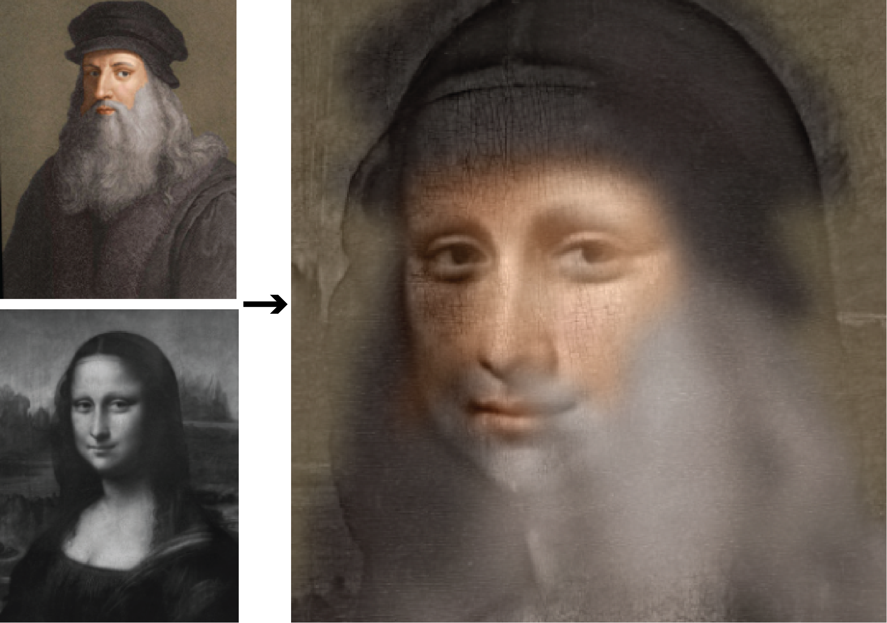
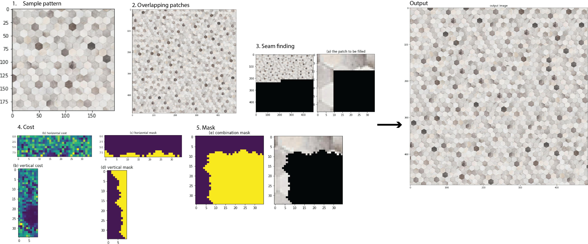
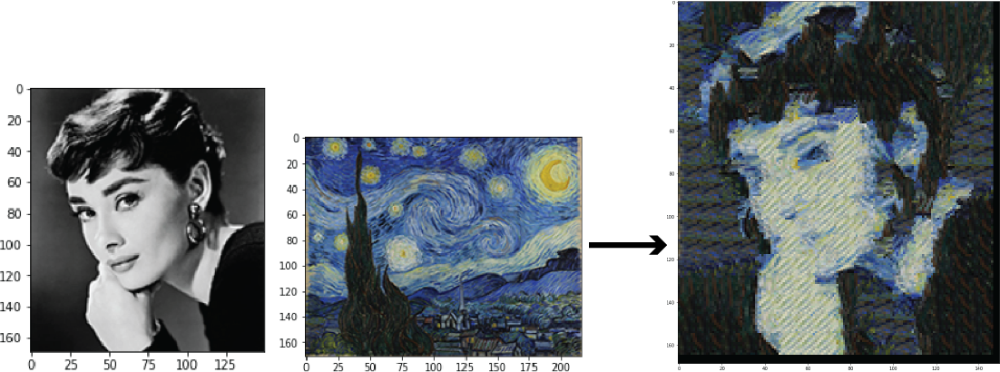
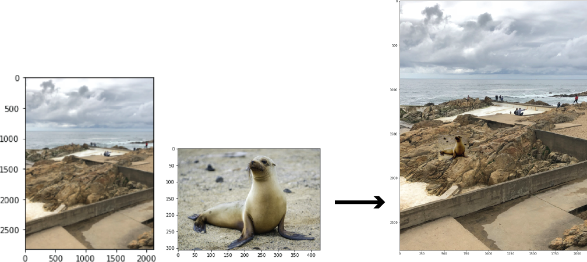
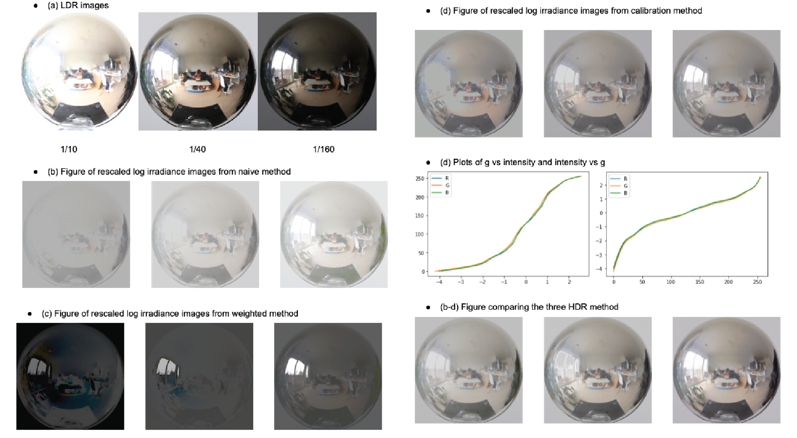
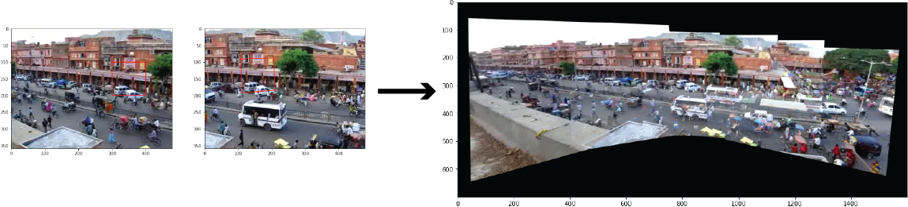

## Advanced Image Processing
+ [1. Hybrid Image](#1-Hybrid-Image)
+ [2. Image Quilting](#2-Image-Quilting)
+ [3. Gradient-Domain Fusion](#3-Gradient-Domain-Fusion)
+ [4. Image-based Lighting](#4-Image-based-Lighting)
+ [5. Video Stitching and Processing](#5-Video-Stitching-and-Processing)
+ [6. Pix2Pix-Zero](https://github.com/xiaorandu/pix2pix_zero)

### 1. Hybrid Image

  Hybrid images are static images that change in interpretation as a function of the viewing distance. The basic idea is that high frequency tends to dominate perception when it is available, but, at a distance, only the low frequency (smooth) part of the signal can be seen. By blending the high frequency portion of one image with the low-frequency portion of another, you get a hybrid image that leads to different interpretations at different distances. See the output below from the notebook [Hybrid Image](https://github.com/xiaorandu/computational_photography_series/blob/main/1_hybrid_image.ipynb).
  
   
   
### 2. Image Quilting

  The image quilting algorithm for **texture synthesis and transfer** is implemented. Texture synthesis is the creation of a larger texture image from a small sample. Texture transfer is giving an object the appearance of having the same texture as a sample while preserving its basic shape. For texture synthesis, the main idea is to sample patches and lay them down in overlapping patterns, such that the overlapping regions are similar. The overlapping regions may not match exactly. To fix this, a path along pixels needs to be computed with similar intensities through the overlapping region and use it to select which overlapping patch from which to draw each pixel. Texture transfer is achieved by encouraging sampled patches to have similar appearance to a given target image, as well as matching overlapping regions of already sampled patches. See the output below from the notebook [Image Quilting](https://github.com/xiaorandu/computational_photography_series/blob/main/2_Image_quilting.ipynb).
  + texture synthesis
   
    
    
  + texture transfer

    
    
### 3. Gradient-Domain Fusion

  Gradient-domain processing is a technique with a broad set of applications including blending, tone-mapping, and non-photorealistic rendering. This project focuses on **Poisson blending**. And the goal is to seamlessly blend an object or texture from a source image into a target image. See the output below from the notebook [Gradient-Domain Fusion](https://github.com/xiaorandu/computational_photography_series/blob/main/3_gradient_domain_fusion.ipynb).
  
  
  
### 4. Image-based Lighting

  The goal of this project is to create HDR images from sequences of low dynamic range (LDR) images and also to composite 3D models seamlessly into photographs using image-based lighting techniques. HDR tonemapping can also be investigated. See the output below from the notebook [Image-based Lighting](https://github.com/xiaorandu/computational_photography_series/blob/main/4_image_based_lighting.ipynb).

  

### 5. Video Stitching and Processing

  This project is manipulate videos by applying several transformations frame by frame. The techniques using interest points, robust matching with RANSAC, homography, and background subtraction are explored. See the output below from the notebook [Video Stitching and Processing](https://github.com/xiaorandu/computational_photography_series/blob/main/5_video_stitching_and_processing.ipynb).

  
  
